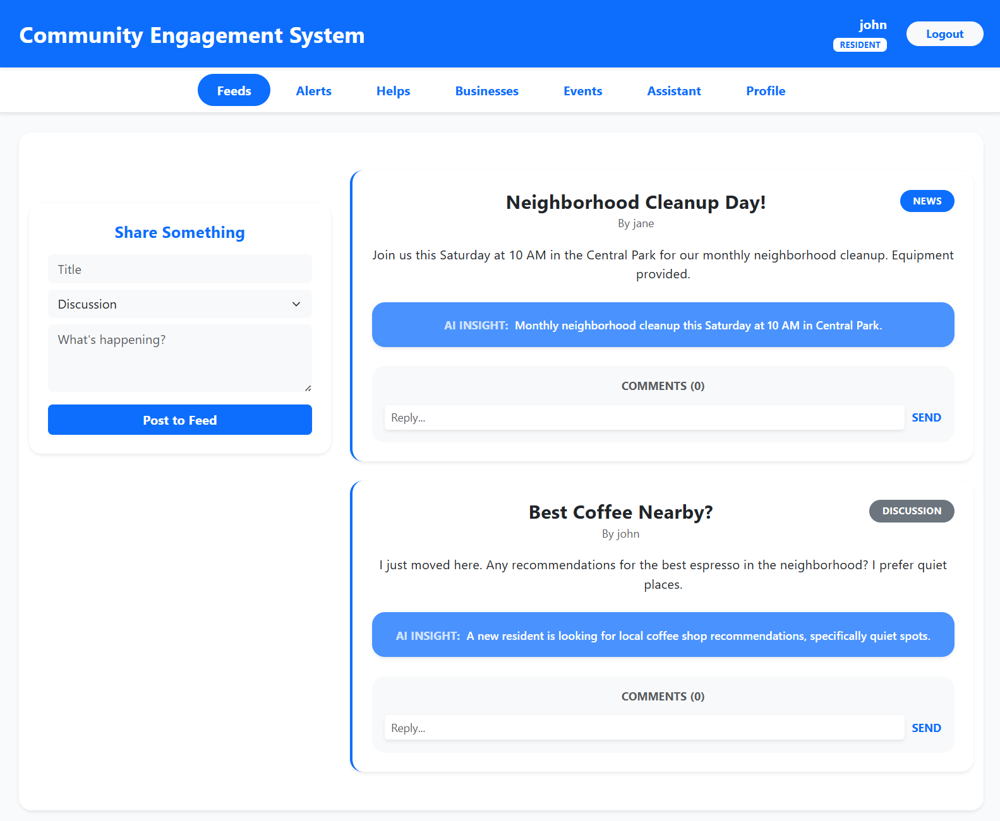
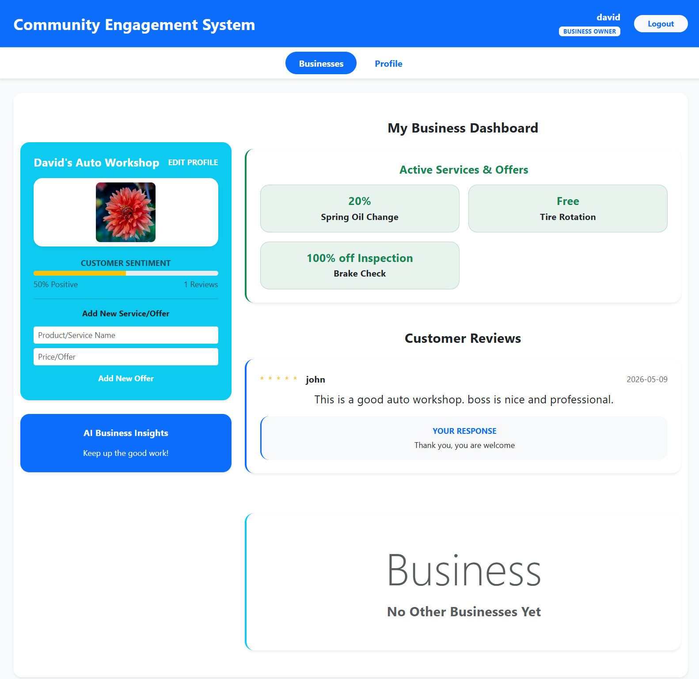
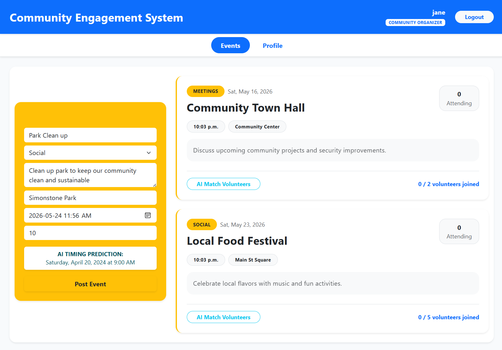
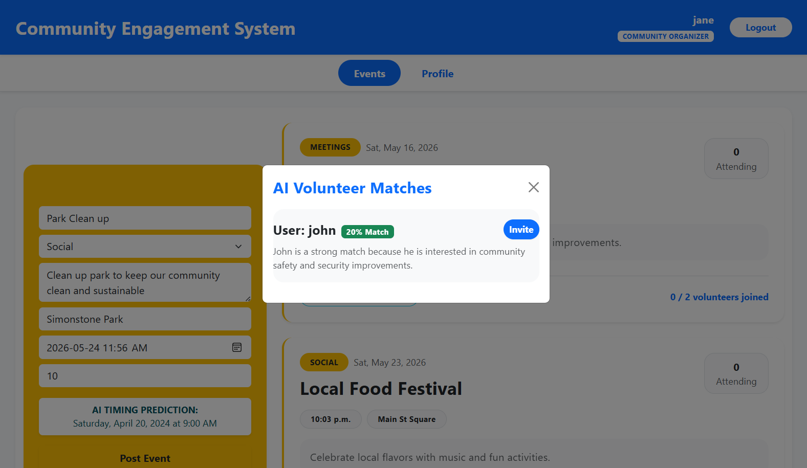
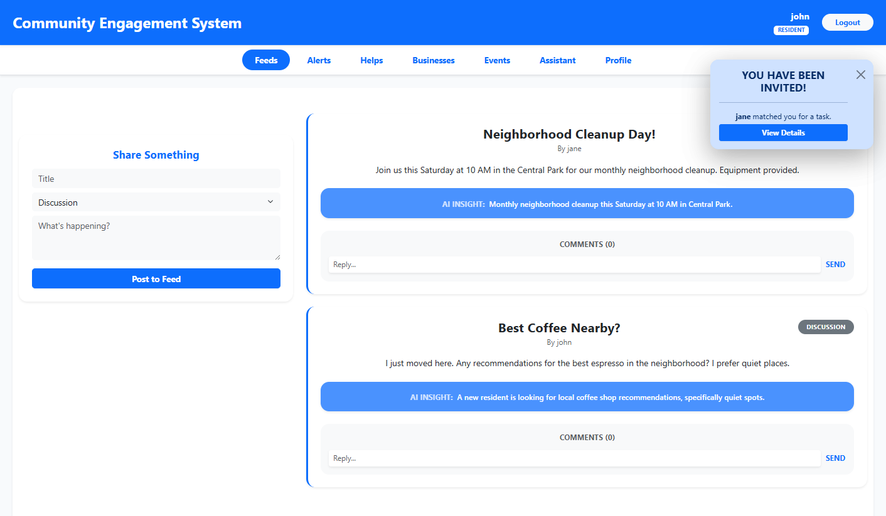
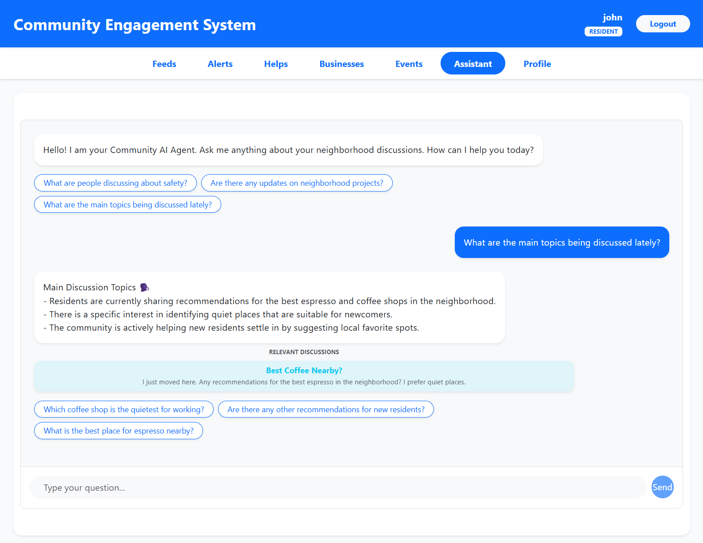
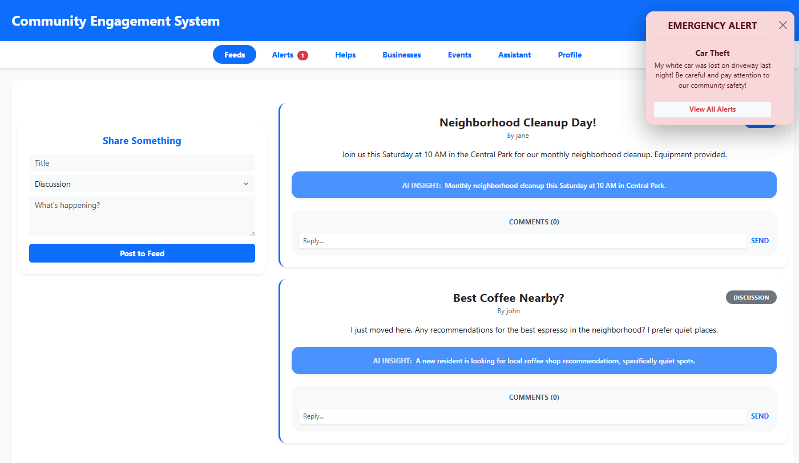

# Community Engagement System

An AI-powered, role-based community platform for residents, business owners, and community organizers. The project demonstrates a modern full-stack architecture with federated GraphQL microservices, React micro-frontends, real-time Socket.io notifications, MongoDB persistence, and Google Gemini AI integrations.

## Why This Project Matters

Community platforms often split conversations, local help, events, and business engagement across separate tools. This system brings those workflows into one portal and adapts the experience by user role:

- Residents can read posts, comment, ask for help, RSVP to events, volunteer, review businesses, and use an AI assistant.
- Business owners can manage their business profile, publish offers, view customer reviews, respond to feedback, and receive AI sentiment insights.
- Community organizers can create events, request volunteers, and use AI-assisted volunteer matching.

The implementation focuses on production-style concerns: service boundaries, role-aware UI, federated API composition, real-time updates, seed data, and practical AI features.

## Core Features

### Community Feed
- Create news or discussion posts.
- Add comments with auto-refreshing success feedback.
- Generate AI summaries for community posts.
- Ask the AI assistant questions about current community discussions.

### Help Requests
- Residents can post requests for local help with a location.
- Other residents can volunteer.
- Request owners can resolve completed requests.
- Organizers/requesters can use AI volunteer matching based on interests and location.

### Business Directory
- Residents can browse local businesses, offers, ratings, and recent reviews.
- Residents can leave reviews tied to a business or specific offer.
- Business owners can launch and edit a profile, upload a profile image, add services/offers, and respond to reviews.
- Review sentiment is analyzed with AI and surfaced as business feedback.

### Events
- Residents can view events, RSVP, and volunteer.
- Community organizers can create events and request volunteers.
- AI suggests concise event timing recommendations.
- AI volunteer matching recommends residents based on event requirements, interests, and location.

### Real-Time Notifications
- Emergency alerts broadcast through Socket.io.
- Volunteer invitations appear in real time.
- Business owners receive live review notifications.

## Technical Highlights

### Frontend
- React 18 with Vite.
- Micro-frontend architecture using `@originjs/vite-plugin-federation`.
- Bootstrap and React Bootstrap for responsive UI.
- Apollo Client for GraphQL queries and mutations.
- Role-aware shell navigation.

| App | Port | Responsibility |
| --- | --- | --- |
| `shell-app` | `3000` | Host app, global navigation, login state, module federation shell |
| `user-app` | `3001` | Login and signup flow |
| `community-app` | `3003` | Feed, help requests, businesses, profile, AI assistant |
| `events-app` | `3204` | Event listing, event creation, RSVP, volunteer flows |

### Backend
- Apollo Federation 2 with a single gateway.
- Node.js, Express, Apollo Server, MongoDB, Mongoose.
- JWT authentication stored in cookies.
- Socket.io for real-time workflows.
- Google Gemini via LangChain integrations.

| Service | Port | Responsibility |
| --- | --- | --- |
| Gateway | `4000` | Federated GraphQL entry point |
| Auth Service | `4001` | Login, registration, user profiles, JWT cookies |
| Community Service | `4003` | Posts, comments, help requests, emergency alerts |
| Business/Event Service | `4004` | Businesses, deals, reviews, events, RSVP/volunteer actions |
| AI Personalization Service | `4005` | AI summaries, sentiment, timing prediction, volunteer matching, chatbot |

## AI Features

- Post summarization for community feed content (News/Discussion). 
- Review sentiment analysis with actionable business-owner feedback.
- Event timing prediction with concise one-line recommendations.
- Volunteer matching using profile interests, location, and task/event context.
- Community AI assistant with retrieved discussion context and suggested follow-up questions.

## Tech Stack

- Frontend: React, Vite, Module Federation, Apollo Client, React Bootstrap, Socket.io Client.
- Backend: Node.js, Express, Apollo Server, Apollo Gateway/Federation, Mongoose, Socket.io.
- Database: MongoDB.
- AI: Google Gemini, LangChain.
- Auth: JWT, bcrypt, cookie-based sessions.

## Getting Started

### Prerequisites

- Node.js 18 or newer.
- MongoDB running locally, or MongoDB connection strings.
- Google Gemini API key for AI features.

### Environment Variables

Create `.env` files where needed, especially under `server/` or each service directory depending on how you run the services.

Common variables:

```bash
JWT_SECRET=replace_with_a_strong_secret
GEMINI_API_KEY=your_gemini_api_key
AUTH_MONGO_URI=mongodb://localhost:27017/authServiceDB
COMMUNITY_MONGO_URI=mongodb://localhost:27017/communityServiceDB
BUSINESS_EVENT_MONGO_URI=mongodb://localhost:27017/businessEventServiceDB
BUSINESS_MONGO_URI=mongodb://localhost:27017/businessEventServiceDB
```

### Run the Backend

1. **Install Dependencies**:
   Install dependencies for the gateway and all microservices:
   ```bash
   cd server
   npm install
   
   cd microservices/auth-service && npm install
   cd ../community-service && npm install
   cd ../business-event-service && npm install
   cd ../ai-personalization-service && npm install
   cd ../..
   ```

2. **Seed Demo Data**:
   From the `server` folder, run the following to populate the databases:
   ```bash
   node seedData.js
   ```

3. **Start All Services**:
   ```bash
   npm run dev
   ```
   This starts the gateway and all backend microservices in parallel.

### Run the Frontend

1. **Install Dependencies**:
   Install dependencies for the shell and all micro-frontends:
   ```bash
   cd client/shell-app && npm install
   cd ../user-app && npm install
   cd ../community-app && npm install
   cd ../events-app && npm install
   cd ../..
   ```

2. **Start the Micro-Frontends**:
   In separate terminals, start the micro-frontends (this builds and serves them for federation):
   ```bash
   cd client/user-app && npm run deploy
   cd client/community-app && npm run deploy
   cd client/events-app && npm run deploy
   ```

3. **Start the Shell App**:
   Finally, start the host app in another terminal:
   ```bash
   cd client/shell-app
   npm run dev
   ```

Open: **`http://localhost:3000`**

## Project Structure

```text
client/
  shell-app/        # Host micro-frontend and global navigation
  user-app/         # Login/signup micro-frontend
  community-app/    # Community feed, help, businesses, profile, AI assistant
  events-app/       # Events and organizer workflows

server/
  gateway.js
  seedData.js
  microservices/
    auth-service/
    community-service/
    business-event-service/
    ai-personalization-service/
```

## Professional Skills Demonstrated

- Designing a role-based product experience across multiple user types.
- Building federated GraphQL services with clear backend boundaries.
- Implementing a micro-frontend architecture with Vite Module Federation.
- Managing authentication, cookies, and protected GraphQL operations.
- Using MongoDB/Mongoose across multiple service databases.
- Integrating practical AI workflows into product features.
- Handling real-time notifications with Socket.io.
- Creating seed data and demo accounts for portfolio review.
- Iterating on UI/UX based on real user workflows.

## Future Improvements

- Add automated unit and integration tests.
- Add CI checks for frontend builds and backend syntax/tests.
- Add image storage through cloud object storage instead of base64 payloads.
- Add pagination for posts, businesses, events, reviews, and help requests.
- Add stricter production environment validation for secrets and API keys.
- Add deployment documentation for cloud hosting.

#### Test Credentials
All accounts use the same password for testing: **`password123`**

| Username | Role |
| --- | --- |
| `john` | Resident |
| `alice` | Resident |
| `bob` | Resident |
| `charlie` | Resident |
| `jane` | Community Organizer |
| `david` | Business Owner |
| `xiaomin` | Business Owner |

## Screenshots

### 1. Resident Experience - Feeds & AI Summaries
Discussion and news feeds with AI-generated insights for residents.


### 2. Business Owner Dashboard - AI Insights
AI-powered customer sentiment analysis and business performance insights.


### 3. Event Management - AI Timing Prediction
Community organizers receive AI-suggested timing recommendations for new events.


### 4. AI Volunteer Matching
Real-time AI matching of residents to help requests and community events based on skills and interests.


### 5. Volunteer Invitations
Residents receive real-time notifications when they are matched for a community task.


### 6. AI Community Assistant
A personalized AI assistant that answers questions about community happenings using live context.


### 7. Real-Time Emergency Alerts
Safety alerts broadcast instantly to all active residents in the neighborhood.

---

Built as a full-stack portfolio project to demonstrate microservices, micro-frontends, GraphQL federation, real-time collaboration, and AI-enhanced community workflows.
